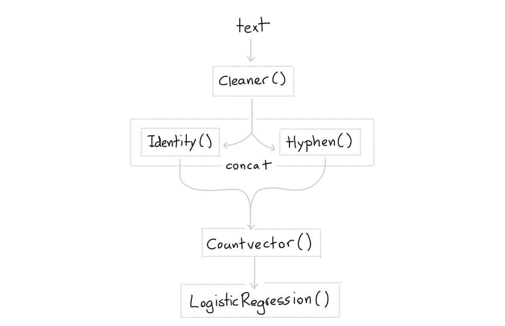

Scikit-Learn pipelines are amazing but they are not perfect for simple text use-cases. 

- The standard pipeline does not allow for interactive learning. You can 
apply `.fit` but that's it. Even if the tools inside of the pipeline have 
a `.partial_fit` available, the pipeline doesn't allow it. 
- The `CountVectorizer` is great, but we might need some more text-tricks 
at our disposal that are specialized towards text to make this object more effective.  

Part of what this library does is give more tools that extend scikit-learn for simple
text classification problems. In this document we will showcase some of the main features.

## Text Preparation Tools

Let's first discuss a basic pipeline for text inside of scikit-learn. 

### Base Pipeline 

This simplest text classification pipeline in scikit-learn looks like this; 

```python
from sklearn.pipeline import make_pipeline 
from sklearn.feature_extraction.text import CountVectorizer
from sklearn.linear_model import LogisticRegression

pipe = make_pipeline(
    CountVectorizer(), 
    LogisticRegression()
)
```

This pipeline will encode words as sparse features before passing them on to the logistic regression.


### Spelling Errors 

For a lot of texts this might work fine, but what do you do with very long texts? When you are classifying online texts you are often confronted with spelling errors. To 
deal with this you'd typically use a [CountVectorizer](https://scikit-learn.org/stable/modules/generated/sklearn.feature_extraction.text.CountVectorizer.html) 
with a character-level analyzer such that you also encode subwords. 

The downside of this approach is that you might wonder if we really *need* all these subwords. So how about this, 
we add a new kind of component to the pipeline that will transform our text such that it can be more easily encoded.  

### Long Texts

There are some other tricks that you might want to apply for longer texts. Maybe you want to summarise a text before
vectorizing it. So maybe it'd be nice to use a transformer that keeps only the most important subwords. 

A neat heuristic toolkit for this is [yake](https://github.com/LIAAD/yake) (you can find a demo 
[here](http://yake.inesctec.pt/demo/sample/)). This package also features a scikit-learn compatible component for it. 

### Bag of Tricks! 

The goal of this library is to host a few meaningful tricks that might be helpful. Here's some more; 

- `Cleaner` lowercase text remove all non alphanumeric characters.
- `Identity` just keeps the text as is, useful when constructing elaborate pipelines.
- `PhoneticTextPrep` translate text into a phonetic encoding. 
- `SpacyPosTextPrep` add part of speech infomation to the text using spaCy.
- `SpacyLemmaTextPrep` lemmatize the text using spaCy.

All of these tools are part of the `textprep` submodule and are documented in detail 
[here](https://koaning.github.io/tokenwiser/api/textprep.html).

## Pipeline Tools 

Pipeline components are certainly nice. But maybe we can go a step further for text. Maybe
we can make better pipelines for text too!

### Concatenate Text

In scikit-learn you would use `FeatureUnion` or `make_union` to concatenate features in 
a pipeline. Ut is assumed that transformers output arrays that need to be concatenated so the
result of a concatenation is always a 2D array. This can be a bit awkward if you're using text preprocessors. 


The reason why we want to keep everything a string is so that the `CountVectorizer` from scikit-learn
can properly encode it. That is why this library comes with a special union
component: `TextConcat`. It concatenates the output of text-prep tools into a string instead of 
an array. Note that we also pack a convenient `make_concat` function too.

```python
from sklearn.pipeline import make_pipeline 
from sklearn.feature_extraction.text import CountVectorizer
from sklearn.linear_model import LogisticRegression
from tokenwiser.pipeline import make_concat

from tokenwiser.textprep import Cleaner, Identity, HyphenTextPrep

pipe = make_pipeline(
    Cleaner(),
    make_concat(Identity(), HyphenTextPrep()),
    CountVectorizer(), 
    LogisticRegression()
)
```

The mental picture for `pipe`-pipeline looks like the diagram below. 


